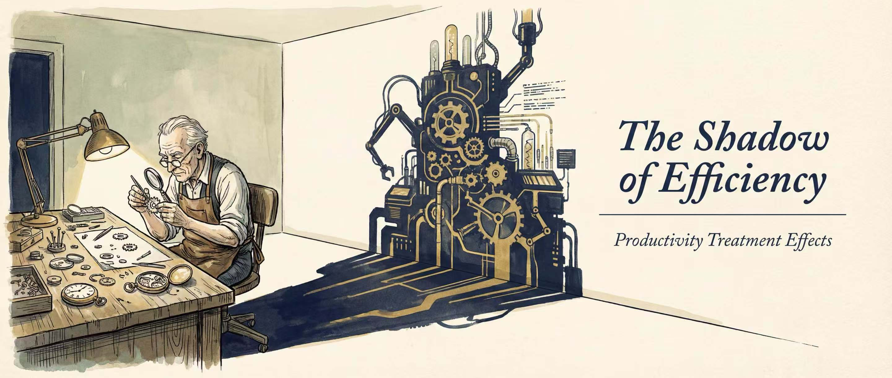

# pte

**Productivity Treatment Effects for Stata**

[](https://www.stata.com/)
[](LICENSE)
[]()

<p align="center">
  
</p>

## Overview

`pte` implements the **Productivity Treatment Effects** framework proposed by
Chen, Liao & Schurter (2026, *RAND Journal of Economics*) for Stata. The package
provides a unified toolkit for applied researchers studying how interventions
affect productive efficiency — integrating semiparametric production function
estimation, causal treatment effect analysis, and Monte Carlo inference in a
single command.

The core innovation is the **CLK correction**: transition-period observations
(where treatment status changes) are excluded from GMM moment conditions, two
separate productivity evolution paths are estimated for treated and control
firms, and counterfactual productivity trajectories are simulated via Monte Carlo
to compute unbiased Average Treatment Effects on the Treated (ATT).

`pte` supports Cobb-Douglas and Translog production functions, clustered
bootstrap inference, treatment-dependent extensions, cohort and heterogeneity
analyses, and publication-quality visualization — all accessible through a
consistent, well-documented interface.

---

## The Productivity Problem

### Why Is This Hard?

Estimating how policies or interventions affect firm productivity is a central
question in industrial organization, development economics, and trade. But the
task is far harder than running a regression of output on treatment dummies.
Two fundamental challenges stand in the way:

**Challenge 1: You cannot directly observe productivity.**

Productivity (TFP) must be *recovered* from a production function, but firms
observe their own productivity before choosing inputs. This creates simultaneous
equations bias: OLS overestimates labor elasticity because productive firms hire
more workers. The proxy variable literature (Olley-Pakes 1996, Levinsohn-Petrin
2003, Ackerberg-Caves-Frazer 2015) solves this — but ignores treatment entirely.

**Challenge 2: Treatment contaminates the productivity evolution.**

Once you recover firm-level productivity, how do you estimate the treatment
effect? The standard approach (TWFE on recovered omega) fails because:

1. **Biased production function estimates.** If treatment changes the mapping
   from inputs to output *during* the transition period, including those
   observations in GMM moment conditions biases the estimated elasticities —
   and therefore biases the recovered productivity itself.

2. **Violated Markov assumption.** The ACF approach assumes productivity follows
   a first-order Markov process. But in the transition year, a treated firm's
   productivity jumps to a *different* law of motion. Pooling both regimes into
   a single evolution law introduces systematic bias.

3. **Heterogeneous dynamics confounded.** TWFE imposes a common treatment
   coefficient across all post-treatment periods, conflating the time-varying
   treatment effect with the structural bias above.

### The Intuition Behind CLK

The CLK framework addresses these problems with a simple but powerful insight:

> *If transition periods are the source of contamination, exclude them from*
> *estimation. If treated and control firms follow different evolution laws,*
> *estimate them separately. If you want the counterfactual, simulate it.*

Concretely:

- **Exclude transitions** — When a firm switches treatment status
  (D_t ≠ D_{t-1}), that observation violates the Markov assumption under either
  regime. Remove it from the GMM moment conditions so production function
  parameters are estimated without contamination.

- **Separate evolution paths** — Estimate one productivity law of motion for
  never-treated/not-yet-treated periods (h̄₀), and another for stably-treated
  periods (h̄₁). This allows treatment to *shift the entire Markov process*.

- **Simulate the counterfactual** — For each treated firm, ask: "What would its
  productivity have been if it had remained under h̄₀?" Draw innovation shocks
  from the estimated control-group distribution and propagate forward. The
  difference between the observed and simulated path is the ATT.

---

## Why CLK Matters: A Comparison

| Method | Endogeneity Corrected | Dynamic Treatment Effect | No Structural Model | Heterogeneous Timing |
|--------|:---------------------:|:------------------------:|:-------------------:|:--------------------:|
| OLS on output | ✗ | ✗ | ✓ | ✗ |
| TWFE on recovered ω | ✓ (partially) | ✗ | ✓ | ✗ |
| Structural IO models | ✓ | ✓ | ✗ | varies |
| prodest + DiD | ✓ | ✗ | ✓ | ✗ |
| **CLK (`pte`)** | **✓** | **✓** | **✓** | **✓** |

**Key advantages of `pte`:**

- No need to specify a structural model of firm behavior
- Correctly handles staggered treatment adoption
- Produces event-study-style dynamic effects (ATT at each post-treatment horizon)
- Production function and treatment effect estimated jointly — not in two
  disconnected steps
- Bootstrap inference accounts for the full estimation uncertainty

---

## How It Works

The `pte` estimation proceeds in four stages, each building on the previous:

### Stage 1: Production Function Estimation (CLK-Corrected GMM)

```
All firms → First-stage polynomial regression → φ̂ (gross productivity proxy)
         → Subtract control variables → φ = φ̂ - X'β_c
         → Exclude transition observations (D_t ≠ D_{t-1})
         → GMM on remaining sample → β (unbiased input elasticities)
```

**Why exclude transitions?** In the year a firm adopts treatment, its input
choices reflect the *new* regime, but its lagged productivity was determined
under the *old* regime. Including this observation creates a moment condition
that mixes two different data-generating processes. Excluding it is conservative
and ensures consistency.

### Stage 2: Productivity Recovery and Evolution Estimation

```
ω_it = φ_it − f(k_it, l_it; β̂)        (recover firm-level productivity)

Control evolution (h̄₀):  ω_t = ρ₀ + ρ₁ω_{t-1} + ρ₂ω²_{t-1} + ρ₃ω³_{t-1} + ε⁰_t
Treated evolution (h̄₁):  ω_t = ρ₀ + ρ₁ω_{t-1} + ... + γD + δ(D×ω_{t-1}) + ε¹_t
```

The innovation shocks ε⁰ are Winsorized at the 1st and 99th percentiles
(following Section 6.3 of the paper) to limit the influence of outliers on the
Monte Carlo simulation.

### Stage 3: ATT via Monte Carlo Counterfactual Simulation

For each treated firm at event-time s: take its last pre-treatment productivity
ω₀, draw N simulation paths (default N = 100) using innovation shocks from the
control-group distribution, propagate forward under h̄₀, and compute:

```
ATT_i(s) = ω_observed(s) − mean(ω⁰_simulated(s))
ATT(s)   = mean over all treated firms at event-time s
```

**Key insight:** The counterfactual uses *only* h̄₀ — the control group's law of
motion. This answers: "What would this firm's productivity have been if it had
never been treated?"

### Stage 4: Bootstrap Inference

For b = 1,...,B: set outer seed = b, resample firms (stratified by treatment
status), repeat Stages 1–3 on resampled data, store ATT(b). Standard errors
and percentile CIs are computed from the bootstrap distribution.

The dual-layer seed design ensures reproducibility: the outer seed governs
resampling; a fixed inner seed (123456) governs Monte Carlo paths within each
bootstrap draw.

---

## Key Features

- **Semiparametric GMM** with CLK correction (Cobb-Douglas and Translog)
- **Firm-level TFP recovery** from estimated production function parameters
- **Dynamic ATT** at each post-treatment horizon via Monte Carlo simulation
- **Clustered bootstrap** with stratified resampling for valid inference
- **Treatment-dependent production function** extensions (Appendix C.1)
- **Cohort analysis** and **heterogeneity analysis** (CATT by subgroup)
- **Method comparison** (CLK vs TWFE vs endogenous) via `pte_compare`
- **Parallel computing** support for bootstrap acceleration
- **Publication-quality visualization** for treatment effects and diagnostics
- **Full `eclass` integration** with `predict` postestimation support

---

## Requirements

- **Stata 14.0** or later
- No additional dependencies for baseline estimation

**Optional workflow packages:**

| Package | Required For | Install |
|---------|-------------|---------|
| `reghdfe` | `pte_compare` (TWFE comparison) | `ssc install reghdfe` |
| `prodest` / `endopolyprodest` | Treatment-dependent workflows | `ssc install prodest` |
| `parallel` | Parallel bootstrap acceleration | `ssc install parallel` |

Run `pte_check_deps` to verify all dependencies before advanced workflows.

---

## Installation

### Method 1: GitHub via `github` Command (Recommended)

```stata
* Install the github command first (one-time setup)
net install github, from("https://haghish.github.io/github/")

* Then install pte directly
github install gorgeousfish/pte
```

### Method 2: GitHub via `net install`

Due to Stata's per-package file limit, `pte` is distributed as three packages
that must all be installed:

```stata
net install pte, from("https://raw.githubusercontent.com/gorgeousfish/pte/main") replace
net install pte_more, from("https://raw.githubusercontent.com/gorgeousfish/pte/main") replace
net install pte_more2, from("https://raw.githubusercontent.com/gorgeousfish/pte/main") replace
```

**Note for users in China:** If you experience connection timeouts, configure
Stata's HTTP proxy or use a GitHub mirror:

```stata
* Option A: HTTP proxy
set httpproxy on
set httpproxyhost "127.0.0.1"
set httpproxyport YOUR_PROXY_PORT

* Option B: GitHub mirror
net install pte, from("https://ghfast.top/https://raw.githubusercontent.com/gorgeousfish/pte/main") replace
net install pte_more, from("https://ghfast.top/https://raw.githubusercontent.com/gorgeousfish/pte/main") replace
net install pte_more2, from("https://ghfast.top/https://raw.githubusercontent.com/gorgeousfish/pte/main") replace
```

### Verifying Installation

```stata
pte_version
```

---

## Quick Start

### Example 1: Basic Estimation (Cobb-Douglas)

The simplest use case estimates a Cobb-Douglas production function with the CLK
correction and computes the ATT over a default 4-period horizon.

```stata
* Load bundled example dataset
pte_example, clear
xtset firm year

* Estimate productivity treatment effects
pte lny, free(lnl) state(lnk) proxy(lnm) treatment(D) pfunc(cd)
```

**Expected output:**

```
----------------------------------------------------------------------
 Productivity Treatment Effects (PTE) - Cobb-Douglas
----------------------------------------------------------------------
  Step 1/4: Production function estimation... done (fval =  3.3e-07)
  Step 2/4: Productivity recovery... done
  Step 3/4: ATT estimation... done
  Step 4/4: Complete
----------------------------------------------------------------------

----------------------------------------------------------------------
Production Function Estimates               Number of obs   =     4,350
  Method: ACF with CLK correction           GMM sample      =     4,350
  Trim eps0: 1%-99%                         Firms           =       500
----------------------------------------------------------------------
    beta_l         =  0.597035
    beta_k         =  0.409394
    GMM obj        =  3.34e-07
----------------------------------------------------------------------
ATT Results (event time 0..4)               Sim. paths      =       100
----------------------------------------------------------------------
 Period |        ATT   Std.Dev.        N
 -------+-----------------------------------
      0 |     0.0004      0.0239       150
      1 |    -0.0001      0.0190       150
      2 |    -0.0002      0.0159       150
      3 |     0.0018      0.0198       150
      4 |     0.0069      0.0334       116
 -------+-----------------------------------
    avg |     0.0015
----------------------------------------------------------------------
```

### Interpreting the Output

**Production function estimates:**

| Field | Meaning |
|-------|---------|
| `beta_l` | Labor output elasticity: 1% more labor → ~0.60% more output |
| `beta_k` | Capital output elasticity: 1% more capital → ~0.41% more output |
| `GMM obj` | Objective value at convergence (< 1e-5 indicates good fit) |
| `Number of obs` | Observations in GMM sample (after excluding transitions) |

**ATT results (Average Treatment Effect on the Treated):**

| Column | Meaning |
|--------|---------|
| `Period` | Event time relative to treatment adoption (0 = year of treatment) |
| `ATT` | Estimated causal effect on log productivity at that horizon |
| `Std.Dev.` | Cross-simulation standard deviation (for formal inference, use bootstrap) |
| `N` | Number of treated firms observed at that event time |
| `avg` | Simple average ATT across all post-treatment periods |

**Reading the results:**

- ATT > 0 means treatment *raised* productivity; ATT < 0 means it *lowered* it
- Values are in log points; multiply by 100 for approximate percentage change
- For statistical significance, add `bootstrap(200)` to obtain SEs and CIs

**Controlling output verbosity:**

```stata
pte ..., pfunc(cd)              * Compact output (default, ~30 lines)
pte ..., pfunc(cd) verbose      * Full diagnostic output (~500 lines)
pte ..., pfunc(cd) nolog        * Silent mode (for scripting)
```

### Example 2: Diagnostics and Visualization

Verify identifying assumptions before reporting results:

```stata
* Run estimation first
pte lny, free(lnl) state(lnk) proxy(lnm) treatment(D) pfunc(cd)

* Test identifying assumptions
pte_diagnose, all

* Visualize ATT trajectory with confidence intervals
pte_graph, att ci

* Visualize productivity evolution paths (treated vs control)
pte_graph, evolution
```

`pte_diagnose` tests parallel pre-trends and distributional assumptions;
`pte_graph` provides publication-ready plots.

### Example 3: Bootstrap Inference (Translog)

The Translog specification allows non-constant returns to scale and input
complementarities:

```stata
pte_example, clear
xtset firm year

* Generate time trend for control
gen trend = year

* Translog with 200 bootstrap replications
pte lny, free(lnl) state(lnk) proxy(lnm) treatment(D) ///
    pfunc(translog) bootstrap(200) control(trend) level(95)

* View inference results
matrix list e(att_se)
matrix list e(att_ci_lower)
matrix list e(att_ci_upper)

* Publication-ready graph with confidence bands
pte_graph, att ci saving(att_results.gph)
```

Bootstrap standard errors are computed via stratified cluster resampling at the
firm level. With 200 replications, expect 5–15 minutes depending on sample size.

### Example 4: Method Comparison

Compare the CLK approach with standard alternatives to demonstrate the
improvement:

```stata
* Requires: reghdfe (ssc install reghdfe)
pte_check_deps

* Run baseline estimation
pte lny, free(lnl) state(lnk) proxy(lnm) treatment(D) pfunc(cd)

* Compare CLK vs TWFE vs endogenous-proxy methods
pte_compare, method(all) diagnose
```

### Example 5: Heterogeneity Analysis

Examine how treatment effects vary across subgroups:

```stata
* After main estimation
pte lny, free(lnl) state(lnk) proxy(lnm) treatment(D) pfunc(cd) bootstrap(200)

* Heterogeneity by industry
pte_heterogeneity, by(industry) test

* Visualize subgroup ATTs
pte_graph, heterogeneity
```

---

## Recommended Workflow

For a complete analysis, follow this four-step workflow:

| Step | Command | Purpose |
|------|---------|---------|
| 1. Setup | `pte_setup` | Validate panel, generate treatment indicators, diagnose data |
| 2. Estimate | `pte` | Production function + productivity recovery + ATT |
| 3. Diagnose | `pte_diagnose` | Test identifying assumptions |
| 4. Report | `pte_graph`, `pte_export` | Visualize and export results |

**Full workflow script:**

```stata
* --- Step 1: Data preparation ---
pte_example, clear
xtset firm year
pte_setup, treatment(D) report

* --- Step 2: Main estimation with bootstrap ---
gen trend = year
pte lny, free(lnl) state(lnk) proxy(lnm) treatment(D) ///
    pfunc(translog) bootstrap(200) control(trend)

* --- Step 3: Diagnostics ---
pte_diagnose, all

* --- Step 4: Visualization and export ---
pte_graph, att ci
pte_export results using "my_table.tex", format(latex) stars(0.01 0.05 0.10)

* --- Optional extensions ---
pte_compare, method(all) diagnose              // Method comparison
pte_heterogeneity, by(industry) test           // Heterogeneity analysis
```

### When to Use Which Command

| Question | Command | Typical Scenario |
|----------|---------|-----------------|
| "Does my data satisfy the assumptions?" | `pte_setup` | First step with any new dataset |
| "What is the treatment effect?" | `pte` | Core estimation |
| "Are the identifying assumptions credible?" | `pte_diagnose` | After estimation, before reporting |
| "Is CLK better than TWFE here?" | `pte_compare` | Referee response, robustness |
| "Does the effect vary by group?" | `pte_heterogeneity` | Heterogeneity analysis |
| "Can I get a publication table?" | `pte_export` | Manuscript preparation |

---

## Data Requirements

Your dataset must satisfy the following before calling `pte`:

| Requirement | Description | Example |
|-------------|-------------|---------|
| Panel structure | Long format, one row per firm-period | Balanced or unbalanced |
| ID variable | Unique firm/unit identifier | `firm`, `plant_id` |
| Time variable | Numeric, `xtset`-compatible | `year`, `quarter` |
| Output (depvar) | Log output, continuous | `lny = log(revenue)` |
| Free input | Log freely-adjustable input | `lnl = log(labor)` |
| State variable | Log state/predetermined input | `lnk = log(capital)` |
| Proxy variable | Log proxy for unobserved productivity | `lnm = log(materials)` |
| Treatment | Binary (0/1), absorbing | `D = 1` after policy |
| No missing values | In estimation variables | `drop if missing(...)` |
| Temporal depth | ≥ 2 pre-treatment periods recommended | For evolution estimation |

**Important notes:**

- All continuous variables should be in **logarithms** (log-linear production
  function).
- Treatment must be **absorbing** (once treated, always treated) for the
  baseline. Non-absorbing support is available as an extension.
- Declare the panel with `xtset id time` before estimation.
- Transition indicators are generated automatically by `pte`.

---

## Command Reference

### Core Estimation

| Command | Description | When to Use |
|---------|-------------|-------------|
| `pte` | Main estimation: production function + ATT + bootstrap | Primary analysis |
| `pte_setup` | Panel validation and treatment-path diagnostics | Before estimation |
| `pte_diagnose` | Assumption tests (parallel trends, KS, CDF) | After estimation |

### Post-Estimation and Reporting

| Command | Description | When to Use |
|---------|-------------|-------------|
| `pte_graph` | Visualization (ATT, evolution, diagnostics) | Visual inspection |
| `pte_compare` | Method comparison (CLK vs TWFE vs endogenous) | Robustness checks |
| `pte_heterogeneity` | Heterogeneity analysis (CATT by subgroup) | Effect variation |
| `pte_export` | Export to LaTeX/CSV/Excel | Publication tables |
| `pte_esttab_att` | Formatted ATT table output | Standardized reporting |
| `pte_p` | Postestimation predictions (ω, fitted, residuals) | Predict interface |

### Utilities

| Command | Description | When to Use |
|---------|-------------|-------------|
| `pte_check_deps` | Verify optional package dependencies | Before advanced workflows |
| `pte_version` | Display version information | Check installed version |
| `pte_example` | Load bundled example dataset | Quick start, testing |

---

## Syntax Reference

```stata
pte depvar, free(varname) state(varname) proxy(varname) treatment(varname) [options]
```

**Required options:**

| Option | Description |
|--------|-------------|
| `free(varname)` | Free input variable (e.g., log labor) |
| `state(varname)` | State variable (e.g., log capital) |
| `proxy(varname)` | Proxy variable (e.g., log materials) |
| `treatment(varname)` | Binary treatment indicator (0/1, absorbing) |

**Key estimation options:**

| Option | Default | Description |
|--------|---------|-------------|
| `pfunc(string)` | `translog` | Production function: `cd` or `translog` |
| `omegapoly(#)` | 3 | Productivity evolution polynomial order (1–4) |
| `attperiods(#)` | 4 | Maximum post-treatment event-time horizon |
| `nsim(#)` | 100 | Number of Monte Carlo simulation paths |
| `bootstrap(#)` | 0 | Bootstrap replications (0 = point only) |
| `by(varname)` | — | Group-by variable (e.g., industry) |
| `control(varlist)` | — | Controls for first-stage regression |
| `seed(#)` | 123456 | Seed for reproducibility |
| `level(#)` | `c(level)` | Confidence level for bootstrap CIs |
| `treatdependent` | — | Treatment-dependent production function |
| `verbose` | — | Full diagnostic output |
| `nolog` | — | Suppress all progress output |

For complete syntax including all advanced options, see `help pte` after
installation.

---

## Stored Results

After estimation, `pte` stores results in `e()`. Key entries:

| Name | Type | Description |
|------|------|-------------|
| `e(N)` | scalar | Number of observations |
| `e(N_g)` | scalar | Number of firms |
| `e(ATT_avg)` | scalar | Average ATT across post-treatment periods |
| `e(att_0)`...`e(att_k)` | scalar | ATT at each event-time horizon |
| `e(att)` | matrix | Full ATT vector: [nt0, ..., ntK, avg] |
| `e(att_se)` | matrix | Bootstrap standard errors |
| `e(att_ci_lower)` | matrix | Lower confidence bound |
| `e(att_ci_upper)` | matrix | Upper confidence bound |
| `e(b_by)` | matrix | Production function coefficients by group |
| `e(cmd)` | macro | `"pte"` |
| `e(pfunc)` | macro | Production function type (`cd`/`translog`) |
| `e(predict)` | macro | Prediction program (`pte_p`) |

For the complete list, type `ereturn list` after estimation or see `help pte`.

---

## Troubleshooting

### GMM Convergence Failure

**Symptom:** `GMM did not converge` or very large objective function value.

1. Check that your proxy variable is genuinely correlated with productivity.
2. Verify that variables are in logs and have reasonable variation.
3. Try `omegapoly(2)` — lower polynomial orders are more stable with small
   samples.
4. Ensure sufficient time-series depth (≥ 5 periods recommended for Translog).

### Sample Too Small for Bootstrap

**Symptom:** Bootstrap produces `missing` standard errors or unstable CIs.

1. You need at least ~50 treated firms for stable bootstrap inference.
2. Reduce `attperiods()` if later horizons have very few observations.
3. Consider pooled estimation if industry groups are too small.

### ATT Results Seem Implausible

**Symptom:** ATT values are unreasonably large (|ATT| > 1 in logs).

1. Try switching between `cd` and `translog` to check robustness.
2. Check `verbose` output for outlier diagnostics.
3. Ensure sufficient pre-treatment periods for evolution estimation.
4. If firms switch back, use the non-absorbing extension.

### Installation Issues

**`r(640)` error:** Install all three sub-packages (`pte`, `pte_more`,
`pte_more2`). Stata limits each package to 100 files.

**Connection timeout (China):** Configure HTTP proxy or use a mirror (see
Installation section).

**`pte_example` not found:** Verify with `which pte_example` and `pte_version`.

---

## Advanced Topics

### Grouped Estimation by Industry

When treatment effects may vary systematically across industries or sectors,
estimate separate production functions for each group:

```stata
pte lny, free(lnl) state(lnk) proxy(lnm) treatment(D) ///
    pfunc(cd) by(industry) bootstrap(200)
```

This estimates separate β_l, β_k, evolution parameters, and ATT for each
industry, then reports group-specific and aggregated results.

### Treatment-Dependent Production Function

If treatment changes not only productivity levels but also the *input
elasticities themselves* (e.g., digitalization changes how labor maps to
output), use the treatment-dependent extension:

```stata
pte lny, free(lnl) state(lnk) proxy(lnm) treatment(D) ///
    pfunc(cd) treatdependent bootstrap(200)
```

This allows β_l and β_k to differ between treated and control regimes,
corresponding to Appendix C.1 of the paper.

### Replicating Paper Results

To reproduce specific tables from Chen, Liao & Schurter (2026), use the
`replicate()` option which pre-configures seeds, sample restrictions, and
simulation settings:

```stata
* Replicate Table 1 (pooled CD)
pte lny, free(lnl) state(lnk) proxy(lnm) treatment(D) ///
    pfunc(cd) replicate(table1)

* Replicate with order-3 polynomial (as in DOs)
pte lny, free(lnl) state(lnk) proxy(lnm) treatment(D) ///
    pfunc(cd) replicate(order3)
```

### Parallel Bootstrap

For large datasets or many bootstrap replications, parallel computing can
substantially reduce computation time:

```stata
* Requires: parallel (ssc install parallel)
pte_check_deps

pte lny, free(lnl) state(lnk) proxy(lnm) treatment(D) ///
    pfunc(translog) bootstrap(500) parallel(4)
```

This distributes bootstrap iterations across 4 Stata instances.

### Postestimation Predictions

After estimation, use `predict` (via `pte_p`) to generate new variables:

```stata
* Recover firm-level productivity
predict omega_hat, omega

* Get individual treatment effects (TT)
predict tt_hat, tt

* Summarize treatment effects among the treated
summarize tt_hat if D == 1, detail
```

---

## Comparison with Related Software

| Package | Language | Method | Dynamic Effects | Bootstrap |
|---------|----------|--------|:---------------:|:---------:|
| `prodest` | Stata | ACF/LP/OP | ✗ | ✗ |
| `acfest` | Stata | ACF | ✗ | ✗ |
| `did` | Stata/R | DiD | ✓ | ✓ |
| `csdid` | Stata | CS-DiD | ✓ | ✓ |
| **`pte`** | **Stata** | **CLK (ACF + DiD)** | **✓** | **✓** |

`pte` is unique in combining production function estimation *and* causal
inference in a single framework. Other packages either estimate production
functions (without treatment effects) or treatment effects (without structural
productivity recovery).

---

## Roadmap

| Version | Feature | Paper Reference |
|---------|---------|----------------|
| v1.1 | Conditional parallel trends test | Section 5 |
| v1.1 | Counterfactual policy evaluation | Appendix D.3 |
| v1.1 | AR(1) process shortcut | Appendix D.1.1 |
| v1.2 | Non-absorbing treatment (full) | Appendix C.3 |
| v1.2 | ATE identification (Diverging Process) | Appendix A.2 |
| v2.0 | Built-in Monte Carlo validation | Section 7 |
| v2.0 | Continuous treatment extension | Conclusion |

---

## Frequently Asked Questions

**Q: How is `pte` different from running `prodest` then a DiD regression?**

The two-step approach introduces bias because: (1) production function estimates
are contaminated by transition-period observations, and (2) a single OLS/TWFE
regression cannot capture heterogeneous evolution dynamics. `pte` solves both
problems jointly in an integrated framework.

**Q: Can I use `pte` with unbalanced panels?**

Yes. Firms must have at least 2 consecutive observations for the evolution law,
and ATT horizons are limited by available post-treatment periods per firm.

**Q: How many bootstrap replications do I need?**

For preliminary analysis, 50–100 replications give rough standard errors. For
publication, 200–500 replications are recommended. Percentile-based confidence
intervals stabilize around 200+.

**Q: What if treatment is not absorbing (firms can switch back)?**

`pte` includes a non-absorbing treatment extension. See `help pte` for the
`nonabsorbing` option.

**Q: Can I use `pte` with service-sector data (no materials proxy)?**

The proxy variable must be monotonically increasing in ω conditional on state
variables. Alternatives include investment, energy consumption, or intermediate
inputs.

**Q: Is Translog always better than Cobb-Douglas?**

Not necessarily. Translog requires more data for stable estimation. With fewer
than ~200 firms or short panels, Cobb-Douglas may be preferable. We recommend
reporting both as a robustness check.

---

## Citation

If you use `pte` in your research, please cite both the methodology paper and
the software:

**Methodology paper:**

> Chen, Z., Liao, M., & Schurter, K. (2026). Identifying Treatment Effects on
> Productivity: Theory with an Application to Production Digitalization.
> *RAND Journal of Economics*.

**Software:**

> Cai, X. & Xu, W. (2026). *pte: Stata module for Productivity Treatment
> Effects estimation* (Version 1.0.0) [Computer software].
> https://github.com/gorgeousfish/pte

**BibTeX:**

```bibtex
@article{chen2026pte,
  title   = {Identifying Treatment Effects on Productivity: Theory with an
             Application to Production Digitalization},
  author  = {Chen, Zhiyuan and Liao, Moyu and Schurter, Karl},
  journal = {RAND Journal of Economics},
  year    = {2026}
}

@software{pte2026stata,
  title   = {pte: Stata module for Productivity Treatment Effects estimation},
  author  = {Cai, Xuanyu and Xu, Wenli},
  year    = {2026},
  version = {1.0.0},
  url     = {https://github.com/gorgeousfish/pte}
}
```

---

## Authors

- **Xuanyu Cai**, City University of Macau
  — [xuanyuCAI@outlook.com](mailto:xuanyuCAI@outlook.com)
- **Wenli Xu**, City University of Macau
  — [wlxu@cityu.edu.mo](mailto:wlxu@cityu.edu.mo)
- **Zhiyuan Chen**, University of Zurich
- **Moyu Liao**, City University of Macau

---

## License

AGPL-3.0. See [LICENSE](LICENSE) for details.
